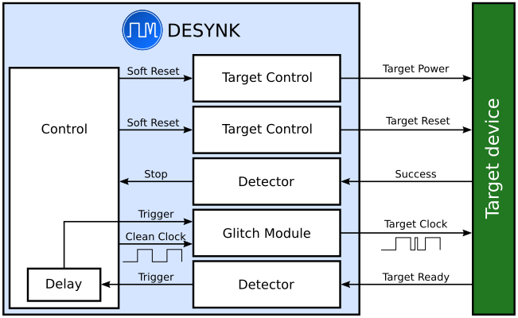
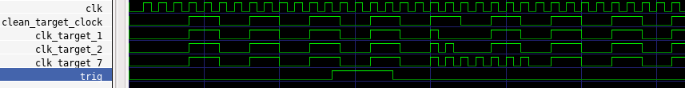

# DESYNK

An iCEBreaker-based hardware glitching thing

## Purpose

Break black-box hardware devices by messing with their clock or power feed.

Specifically, a glitch introduced at the right time can bypass individual instructions,
which has interesting security implications.

## Functionality

Several of the blocks above are designed to have drop-in replacements. For
example, the _Detector_ module used to trigger glitching. This must detect a
predictable and stable starting state in the target device. In some cases,
perhaps it's enough to snoop an indicator LED. For other targets, perhaps an
I2C bus must be sniffed to detect a specific message. Implement a new
_Detector_ module and connect it!

The _Control_ block consists of a very simple state machine:
1. Wait for the trigger signal, indicating the target is ready
2. Start the delay countdown
3. At the end of the delay, inject a glitch
4. If a _Success_ signal is detected, halt
5. Alter the delay
6. Reset the target device
7. Start over

On _Success_, we've found a specific _Delay_ value (counted in cycles) and a
specific _glitch mode_ which causes the target device to do what we want it to
do.

## Setup

A target device, running something sensitive. For example, computes some hash and checks its result against a fixed "proper" value.

Connections to the DESYNK board:

* CLK which drives the target device
* TRIGGER which the target sets HIGH at a fixed time before the check
* SUCCESS which the target sets HIGH if the check is bypassed
* POWER which enables the power feed to the target device
* BROWNOUT which grounds the power feed of the target device

## Glitch Modes
### `glitch_clk_fast`
Injects a number of faster clock cycles on the target's clock input. The following figure shows three different
instances of the glitching module, injecting 1, 2 and 7 cycles respectively.

## Detector Modules
### `detect_edge`
Triggered by a simple digital input signal. Set `RISING_EDGE=1` to detect leading edge, or `RISING_EDGE=0` to trigger on a falling edge.

## Usage
**This is all theoretical, since nothing is implemented**

The USR button on the iCEBreaker resets the board. On boot, a normal 16MHz clock signal is generated without glitches,
to allow for target reprogramming and such.

The top button starts glitching. The top LED indicates that glitching is underway.

## Ideas

Modular target control to reset the target
* Direct power control
* Reset pin on the target

Modular detector for TRIGGER and SUCCESS signals
* Signal pin
* UART snooping

Modular glitch mode:
* Single quick-cycle
* Skip cycle
* Multiple quick cycles
* Power glitches

Some sort of parameter based way to select and configure the modules.
Ideally, you can alter some commented parameters in a "config" file and then just instantiate a `desynk` which will
be configured as you want it.
